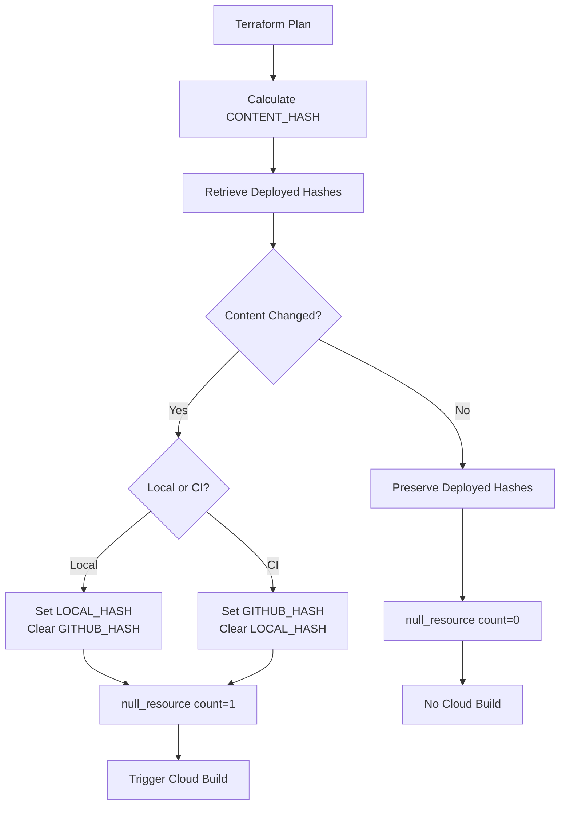

# Hash Preservation System - Complete Guide

## Overview

The hash preservation system ensures that Terraform only triggers Cloud Build when code actually changes, while correctly tracking **who** deployed (local developer vs CI) and preserving deployment metadata across unchanged deployments.

## Core Concepts

### Three Hash Types

1. **CONTENT_HASH**: Pure SHA-256 hash of codebase files
   - Calculated natively in Terraform using `fileset()` and `sha256()`
   - Line-ending normalized (CRLF → LF)
   - Excludes: `node_modules/`, `__pycache__/`, `.venv/`, temp files
   - Example: `ecf268a72bed137febea739e04aa41e65ef9cfe66009e514563eb6bcf87597a2`

2. **LOCAL_HASH**: Identifies local developer deployments
   - Format: `{CONTENT_HASH}_{username}`
   - Example: `ecf268a72bed137febea739e04aa41e65ef9cfe66009e514563eb6bcf87597a2_aungk`
   - Set only when: Local deployment AND content changed

3. **GITHUB_HASH**: Identifies CI deployments
   - Format: `sha256("{CONTENT_HASH}-{commit_sha}-{github_username}")`
   - Example: `d528497a0ab7ba23ceebb501192818e4611d85d9b0e8770591d07336bfa80660`
   - Set only when: CI deployment AND content changed

## How It Works

### Deployment Flow



### Hash Preservation Logic

**modules/cloud-run-service/main.tf** and **modules/cloud-scheduler/main.tf**:

```terraform
locals {
  # Retrieve deployed hashes
  deployed_content_hash = data.external.deployed_hash.result.deployed_content_hash
  deployed_local_hash   = data.external.deployed_hash.result.deployed_local_hash
  deployed_github_hash  = data.external.deployed_hash.result.deployed_github_hash
  
  # Check if content changed
  content_has_changed = local.deployed_content_hash == "" || 
                        local.deployed_content_hash != local.content_hash_value
  
  # LOCAL_HASH logic:
  # - Content changed + Local deploy → Set new LOCAL_HASH
  # - Content changed + CI deploy → Clear it (empty string)
  # - Content unchanged → Preserve existing value
  local_hash_value = local.content_has_changed ? (
    local.is_local_deployment && var.local_username != "" ? 
      "${local.content_hash_value}_${var.local_username}" : ""
  ) : local.deployed_local_hash
  
  # GITHUB_HASH logic:
  # - Content changed + CI deploy → Set new GITHUB_HASH
  # - Content changed + Local deploy → Clear it (empty string)
  # - Content unchanged → Preserve existing value
  github_hash_value = local.content_has_changed ? (
    local.is_ci_deployment && var.github_username != "" ? 
      sha256("${local.content_hash_value}-${var.github_sha}-${var.github_username}") : ""
  ) : local.deployed_github_hash
}
```

### Build Trigger Logic

```terraform
resource "null_resource" "scheduler_job_image_build" {
  count = local.content_has_changed ? 1 : 0  # ← Key: count controls execution
  
  triggers = {
    content_hash    = local.content_hash_value
    deployed_hash   = local.deployed_content_hash
    container_image = local.container_image
  }
  
  provisioner "local-exec" {
    command = "gcloud builds submit ..."  # Only runs when count=1
  }
}
```

**How count prevents unnecessary builds:**

| Content Changed? | count | Terraform Action | Cloud Build? |
|-----------------|-------|------------------|--------------|
| ❌ No | 0 | Destroy null_resource | ❌ No |
| ✅ Yes | 1 | Create/Replace null_resource | ✅ Yes |

## Deployment Scenarios

### Scenario 1: Local Deployment with Changes

```bash
# Developer modifies code locally
terraform apply -var="local_username=aungk"
```

**Result:**
- `content_has_changed = true`
- `LOCAL_HASH = "ecf268a72bed...._aungk"`
- `GITHUB_HASH = ""` (cleared)
- Cloud Build triggered ✅

### Scenario 2: CI Deployment with No Changes

```bash
# GitHub Actions runs terraform apply
terraform apply -var="github_sha=abc123" -var="github_username=actions"
```

**Result:**
- `content_has_changed = false`
- `LOCAL_HASH = "ecf268a72bed...._aungk"` (preserved from previous local deploy)
- `GITHUB_HASH = ""` (preserved as empty)
- Cloud Build **NOT triggered** ✅

### Scenario 3: CI Deployment with Changes

```bash
# GitHub Actions runs terraform apply after code commit
terraform apply -var="github_sha=def456" -var="github_username=actions"
```

**Result:**
- `content_has_changed = true`
- `LOCAL_HASH = ""` (cleared)
- `GITHUB_HASH = "d528497a0ab..."` (new CI hash)
- Cloud Build triggered ✅

### Scenario 4: Local Deployment with No Changes

```bash
# Developer runs terraform apply without code changes
terraform apply -var="local_username=aungk"
```

**Result:**
- `content_has_changed = false`
- `LOCAL_HASH = "ecf268a72bed...._aungk"` (preserved)
- `GITHUB_HASH = ""` (preserved)
- Cloud Build **NOT triggered** ✅

## Script Implementation

### get_deployed_content_hash.ps1 (PowerShell)

```powershell
# Reads JSON from stdin (Terraform external data source)
$inputJson = [Console]::In.ReadToEnd() | ConvertFrom-Json

# Query Cloud Run API
$json = gcloud run jobs describe $resource_name --format=json | ConvertFrom-Json

# Extract hashes from environment variables
$envVars = $json.spec.template.spec.template.spec.containers[0].env
$contentHash = ($envVars | Where-Object { $_.name -eq "CONTENT_HASH" }).value
$localHash = ($envVars | Where-Object { $_.name -eq "LOCAL_HASH" }).value
$githubHash = ($envVars | Where-Object { $_.name -eq "GITHUB_HASH" }).value

# Return JSON with all three hashes
Write-Output @"
{"deployed_content_hash":"$contentHash","deployed_local_hash":"$localHash","deployed_github_hash":"$githubHash"}
"@
```

### get_deployed_content_hash.sh (Bash)

```bash
#!/bin/bash
# Reads JSON from Terraform
eval "$(jq -r '@sh "project_id=\(.project_id) region=\(.region)"')"

# Query Cloud Run API
json_output=$(gcloud run jobs describe "$resource_name" --format=json 2>/dev/null || echo "")

# Extract hashes using jq
if [ -n "$json_output" ]; then
  deployed_content_hash=$(echo "$json_output" | jq -r '.spec.template.spec.template.spec.containers[0].env[]? | select(.name=="CONTENT_HASH") | .value')
  deployed_local_hash=$(echo "$json_output" | jq -r '.spec.template.spec.template.spec.containers[0].env[]? | select(.name=="LOCAL_HASH") | .value')
  deployed_github_hash=$(echo "$json_output" | jq -r '.spec.template.spec.template.spec.containers[0].env[]? | select(.name=="GITHUB_HASH") | .value')
fi

# Return JSON
jq -n --arg content "$deployed_content_hash" --arg local "$deployed_local_hash" --arg github "$deployed_github_hash" \
  '{"deployed_content_hash":$content,"deployed_local_hash":$local,"deployed_github_hash":$github}'
```

## Troubleshooting

### Issue: "Saved plan is stale"

**Cause:** State changed between `terraform plan` and `terraform apply`

**Solution:**
```bash
terraform plan -out=tfplan
terraform apply tfplan  # Apply immediately
```

### Issue: null_resource being destroyed on unchanged content

**Status:** ✅ **This is correct behavior!**

**Explanation:**
- `count = 0` when content unchanged → Destroys null_resource
- Destroying null_resource = **No provisioner execution** = **No Cloud Build**
- This is how the system **prevents** unnecessary rebuilds

**Plan output example:**
```
# module.jobs["daily-data-processor"].null_resource.scheduler_job_image_build[0] will be destroyed
# (because index [0] is out of range for count)
```

This means: "Content unchanged, don't build"

### Issue: Hash mismatch after switching calculation methods

**Cause:** Migration from external scripts to native Terraform changes hash for same files

**Solution:** One-time sync deployment:
1. Apply the plan to update the hash
2. Subsequent deployments will correctly detect "no changes"

**Example:**
```
Old hash (external): f6cd758065870b1e74f6f10831aa4e2a8988268020a51b86585505fb778eb310
New hash (native):   ecf268a72bed137febea739e04aa41e65ef9cfe66009e514563eb6bcf87597a2
```

### Issue: Scripts failing with "exit status 1"

**Cause:** Resource doesn't exist yet (first deployment) and script exits on error

**Fix Applied:**
- PowerShell: Removed param(), reads from stdin, null checks before accessing properties
- Bash: Removed `set -e`, checks if json_output is not empty before parsing

## Testing

### Verify Hash Preservation

```powershell
# Test local deployment (no changes)
terraform plan -var="local_username=aungk" | Select-String "No changes"

# Test CI deployment (no changes)
terraform plan -var="github_sha=test" -var="github_username=actions" | Select-String "No changes"

# Verify deployed hashes
$query = @{project_id="cpe-final-project"; region="asia-southeast1"; resource_name="dvb-crawler-job"; resource_type="job"} | ConvertTo-Json -Compress
Write-Output $query | PowerShell -File "scripts\get_deployed_content_hash.ps1"
```

### Expected Test Results

**NO changes scenario:**
```
Plan: 0 to add, 0 to change, 0 to destroy.
```

**WITH changes scenario (dvb-crawler-job only):**
```
Plan: 1 to add, 1 to change, 5 to destroy.

# Where:
# - 1 to add: new null_resource for dvb-crawler-job
# - 1 to change: update dvb-crawler-job env vars
# - 5 to destroy: null_resources for unchanged resources (count=0)
```

## Best Practices

1. **Always run terraform plan first** to verify only expected resources will rebuild

2. **Commit often** to keep CONTENT_HASH tracking granular changes

3. **Use .gitattributes** to enforce consistent line endings:
   ```
   * text=auto eol=lf
   *.py text eol=lf
   *.tf text eol=lf
   ```

4. **Monitor hash outputs** after deployment:
   ```bash
   terraform output -json | jq '.jobs.value'
   ```

5. **Understand null_resource count behavior**:
   - Destroyed = Good (no rebuild)
   - Created/Replaced = Build triggered

## Architecture Benefits

✅ **Smart Rebuilds**: Only builds when content actually changes  
✅ **Deployment Tracking**: Know who deployed (local dev vs CI)  
✅ **State Preservation**: Unchanged deployments don't lose metadata  
✅ **Cross-Platform**: Works on Windows, Linux, macOS  
✅ **Native Terraform**: No external dependencies for hash calculation  
✅ **CI/CD Ready**: Integrates seamlessly with GitHub Actions  

## Related Documentation

- [HASH_CONTROL_README.md](HASH_CONTROL_README.md) - Initial hash system design
- [IMPLEMENTATION_SUMMARY.md](IMPLEMENTATION_SUMMARY.md) - Migration to native Terraform
- [MIGRATION_COMPLETE.md](MIGRATION_COMPLETE.md) - Hash calculation migration notes
