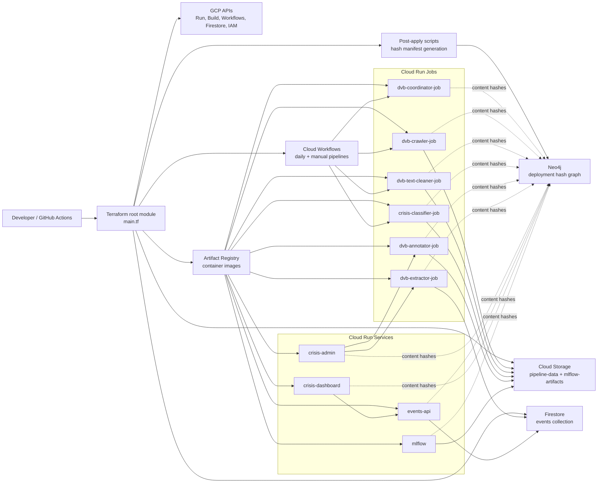

# CPE Final Project - Cloud Infrastructure & Data Pipeline

Terraform-managed GCP infrastructure for a DVB Burmese crisis-news data pipeline, MLflow tracking, admin review, event extraction, and dashboard services.

> **Note**: Hash preservation system with smart rebuild detection - only builds when code changes!

## Project Overview

This project provides a complete cloud infrastructure setup with:
- **DVB Data Pipeline**: Coordinator, crawler, cleaner, classifier, annotator, and extractor jobs
- **Admin and Dashboard Services**: Crisis article review, events API, and dashboard frontend
- **MLflow Tracking Server**: Experiment tracking and model artifact storage
- **Cloud Workflows**: Daily and manual date-range pipeline orchestration
- **Neo4j Dependency Graph**: Auto-synced system graph with content-hash dependency nodes after deploy

## Infrastructure Diagram



Full architecture diagrams are in [diagrams/README.md](diagrams/README.md).

## Quick Start (Simplified Deployment)

Just run Terraform directly - **all hash values are auto-computed**:

```powershell
# Windows
terraform init
terraform plan
terraform apply
```

```bash
# Linux/Mac  
terraform init
terraform plan
terraform apply
```

**What happens automatically:**
- ✅ **Content hash** computed from each codebase directory
- ✅ **Username** detected for deployment tracking
- ✅ **Hash comparison** - only deploys if code changed
- ✅ **Neo4j graph manifest** generated after apply
- ✅ **Neo4j graph sync** updates the external database automatically when configured

**Documentation:**
- [CODEBASE_SUMMARY.md](CODEBASE_SUMMARY.md) - Codebase map, runtime components, and data flow
- [HOW_TO_USE.md](HOW_TO_USE.md) - Setup, deploy, run, clean, and maintenance instructions
- [MANUAL_PIPELINE_COMMANDS.md](MANUAL_PIPELINE_COMMANDS.md) - Manual workflow/job invocation commands
- [diagrams/README.md](diagrams/README.md) - Architecture and workflow diagrams

**Helper scripts** in `scripts/` are now optional utilities.

## Project Structure

```
CPE_Final_Project/
│
├── Infrastructure (Root)
│   ├── main.tf                    # Main infrastructure configuration
│   ├── variables.tf               # Configurable variables
│   ├── outputs.tf                 # Infrastructure outputs
│   ├── provider.tf                # GCP provider configuration
│   ├── terraform.tfvars.example   # Configuration template
│   └── shell.nix                  # Nix development environment
│
├── .github/                       # GitHub Actions CI/CD
│   ├── workflows/
│   │   └── terraform-deploy.yml   # Automated deployment workflow
│   └── GITHUB_ACTIONS_SETUP.md    # CI/CD setup guide
│
├── utils/                         # Shared utilities
│   ├── gcs_utils.py               # Python GCS utilities
│   ├── gcs_utils.js               # JavaScript GCS utilities
│   └── README.md                  # Utils documentation
│
├── bootstrap/
│   └── neo4j/                     # External Neo4j graph bootstrap + loader
│       ├── graph_manifest.json    # Base system graph definition
│       ├── generated/             # Generated graph with deployment hash nodes
│       ├── load_graph.py          # Neo4j sync loader
│       └── README.md              # Neo4j bootstrap docs
│
├── Codebase_Container/            # Application code
│   ├── mlflow/                    # MLflow service container assets
│   │   ├── Dockerfile             # MLflow container
│   │   └── cloudbuild.yaml        # Cloud Build configuration
│   │
│   ├── crawler_job/               # DVB Burmese news crawler
│   │   ├── DVB_Burmese.crawler.js # Web scraper implementation
│   │   ├── package.json           # Node.js dependencies
│   │   ├── Dockerfile             # Container definition
│   │   └── cloudbuild.yaml        # Cloud Build configuration
│   │
│   ├── cloud_scheduler_function/  # Scheduled data processor
│   │   ├── main.py                # Processor logic
│   │   ├── Dockerfile             # Container definition
│   │   └── cloudbuild.yaml        # Cloud Build configuration
│   │
│   └── gpu_batch_job/             # GPU-accelerated processing
│       ├── main.py                # GPU workload
│       ├── Dockerfile             # CUDA container
│       └── cloudbuild.yaml        # Cloud Build configuration
│
└── modules/                       # Terraform modules
    ├── cloud-scheduler/           # Cloud Run Job + Scheduler module
    │   ├── main.tf                # Job and scheduler resources
    │   ├── variables.tf           # Module inputs
    │   └── outputs.tf             # Module outputs
    │
    ├── cloud-run-service/         # Cloud Run Service module
    │   ├── main.tf                # Service resources
    │   ├── variables.tf           # Module inputs
    │   └── outputs.tf             # Module outputs
```

## Infrastructure Components

### Cloud Run Jobs
1. **DVB Coordinator** (`dvb-coordinator-job`)
   - Discovers article links for date ranges
   - Invokes crawler jobs for discovered articles

2. **DVB Crawler** (`dvb-crawler-job`)
   - Fetches DVB Burmese article content
   - Stores raw article data in GCS

3. **Text Cleaner** (`dvb-text-cleaner-job`)
   - Cleans crawled article text
   - Preserves content-hash lineage

4. **Crisis Classifier** (`crisis-classifier-job`)
   - Classifies cleaned articles as crisis-related or non-crisis

5. **Annotator and Extractor** (`dvb-annotator-job`, `dvb-extractor-job`)
   - Annotates crisis articles
   - Extracts structured events into Firestore

### Cloud Run Services (Always-On HTTP)
1. **MLflow Tracking Server** (`mlflow`)
   - Experiment tracking and model registry
   - 2 CPU / 4Gi memory
   - Autoscaling 0-5 instances
   - Artifacts stored in GCS
   - Port 8080 (internal by default)

2. **Crisis Admin** (`crisis-admin`)
   - Review portal for crisis articles
   - Can trigger annotation and extraction jobs

3. **Events API** (`events-api`)
   - Reads extracted event records from Firestore

4. **Crisis Dashboard** (`crisis-dashboard`)
   - Frontend visualization for crisis event data

### Storage Buckets
- `{project-id}-pipeline-data` - Shared pipeline data bucket (180-day retention)
- `{project-id}-mlflow-artifacts` - MLflow artifacts (90-day retention)

## Quick Start

### Prerequisites
- Google Cloud Project with billing enabled
- `gcloud` CLI installed and authenticated
- Terraform >= 1.0
- Docker (for local testing)

### 1. Configure Project

```bash
# Copy tracked examples
cp terraform.tfvars.example terraform.tfvars
cp .env.example .env

# Put non-sensitive settings in terraform.tfvars
# Put secrets and TF_VAR_* values in .env
```

Recommended split:
- `terraform.tfvars`: non-sensitive values like `project_id`, `region`, `zone`, `environment`
- `.env`: sensitive values like `TF_VAR_hf_token` and `TF_VAR_gemini_api_key`

### 2. Deploy Infrastructure

```bash
# Initialize Terraform
terraform init

# Preview changes
terraform plan

# Deploy infrastructure
terraform apply
```

This will:
- ✅ Enable required GCP APIs
- ✅ Create Artifact Registry repository
- ✅ Build and push Docker images via Cloud Build
- ✅ Create GCS buckets with lifecycle policies
- ✅ Deploy Cloud Run jobs and services
- ✅ Set up Cloud Scheduler for automated runs
- ✅ Configure IAM permissions
- ✅ Generate a hash-aware dependency graph manifest
- ✅ Sync the generated graph to Neo4j when `NEO4J_AUTO_LOAD=true`

### Neo4j Graph Sync

Terraform post-action automation now exports the deployed system topology into Neo4j.

The generated graph includes:
- one `DeploymentHash` node per job or service content hash
- `HAS_HASH` edges from jobs and services to their content hash nodes
- `deployment_source`, `updater`, and `deployment_ref` properties on each hash node
- direct `READS_FROM` and `WRITES_TO` lineage edges between content-hash nodes and storage buckets
- `DEPENDS_ON_DATA_FROM` edges between content-hash nodes based on bucket-level data flow

Runtime hash contract used by jobs/services:
- producer writes output under `prefix/<CONTENT_HASH>/<YYYY-MM-DD>/...`
- consumer writes output under its own `prefix/<CONTENT_HASH>/<YYYY-MM-DD>/...`
- consumer reads upstream hash in this priority order:
  1) `SOURCE_CONTENT_HASH` env var override
  2) Neo4j query on upstream component `HAS_HASH` -> `DeploymentHash.hash_value`
  3) GCS fallback scan (latest blob `updated` time)

To enable automatic sync after `make apply` or `make deploy`, configure these values in `.env`:

```dotenv
NEO4J_URI=neo4j+s://your-instance.databases.neo4j.io
NEO4J_USER=your-neo4j-user
NEO4J_PASSWORD=your-neo4j-password
NEO4J_DATABASE=neo4j
NEO4J_MANIFEST_PATH=bootstrap/neo4j/generated/terraform_post_action_graph.json
NEO4J_AUTO_LOAD=true
```

If you want to skip the Neo4j update but still generate the manifest, set `NEO4J_AUTO_LOAD=false`.

### 3. Verify Deployment

```bash
# Check deployed jobs
gcloud run jobs list --region=asia-southeast1

# Check services
gcloud run services list --region=asia-southeast1

# View scheduler jobs
gcloud scheduler jobs list --location=asia-southeast1
```

### 4. Restart and Redeploy the System

Use this when you need a clean slate and want to bring the whole system back up again.

```bash
# Destructive reset: clears Firestore events, Neo4j hash nodes, and GCS bucket objects
make system-restart CONFIRM=true

# Rebuild, apply, and run the post-apply sync
make deploy AUTO_APPROVE=true
```

What happens during the redeploy:
- `system-restart` removes transient data only, not the Terraform code itself
- `deploy` runs `terraform plan` and `terraform apply`, then executes `make post-apply`
- `post-apply` regenerates the Neo4j graph manifest and seeds `.FOLDER_CREATED` markers in GCS using the current FolderHash values when available

If you only need to refresh the Neo4j graph without a full reset, use `make restart-graph` instead.

## Usage

### Running Jobs Manually

For a complete command reference (full workflow execution, job-by-job execution, and monitoring), see [MANUAL_PIPELINE_COMMANDS.md](MANUAL_PIPELINE_COMMANDS.md).

**Daily workflow:**
```bash
make daily-pipeline
```

**Manual date-range workflow:**
```bash
make manual-coordinator START_DATE=20-03-2026 END_DATE=21-03-2026
```

**DVB crawler job direct run:**
```bash
gcloud run jobs execute dvb-crawler-job \
  --region=asia-southeast1 \
  --wait
```

### Accessing MLflow

**Get MLflow URL:**
```bash
# If public access is enabled
gcloud run services describe mlflow \
  --region=asia-southeast1 \
  --format="value(status.url)"

# For internal access, use Cloud Run proxy:
gcloud run services proxy mlflow --region=asia-southeast1
```

### Viewing Crawler Output

**List crawled files:**
```bash
gsutil ls gs://{project-id}-pipeline-data/
```

**Download specific date:**
```bash
gsutil -m cp -r gs://{project-id}-pipeline-data/<prefix>/<content-hash>/2026-03-20/ ./
```

### Monitoring

**View job logs:**
```bash
gcloud logging read "resource.type=cloud_run_job AND resource.labels.job_name=dvb-crawler-job" \
  --limit=50 \
  --format=json
```

**Check workflow executions:**
```bash
gcloud workflows executions list daily-pipeline \
  --location=asia-southeast1
```

## Development

### Local Testing

**Test crawler locally:**
```bash
cd Codebase_Container/crawler_job
npm install
node DVB_Burmese.crawler.js
```

**Test GPU job locally (requires NVIDIA GPU):**
```bash
cd Codebase_Container/gpu_batch_job
pip install -r requirements.txt
python main.py
```

### Development Environment

Enter Nix development environment with all tools:
```bash
nix-shell
```

Provides:
- Terraform
- Google Cloud SDK
- Python 3.12
- Node.js
- All required CLI tools

### Modifying Jobs

1. Edit code in `Codebase_Container/{job_name}/`
2. Run `terraform apply` to rebuild and redeploy
3. Terraform automatically detects code changes and rebuilds images

## Architecture Details

### DVB Crawler Pipeline
1. **Workflow**: `daily-pipeline` or `manual-coordinator` orchestrates the run.
2. **Coordinator**: Discovers article URLs for the requested date range.
3. **Crawler**: Fetches DVB Burmese article text and metadata.
4. **Storage**: Uploads outputs to the shared pipeline GCS bucket organized by component hash and date.
5. **Downstream jobs**: Cleaning, classification, annotation, and extraction advance the data toward Firestore event records.

### Deployment Hash Tracking
- **Content hashes**: Computed from each deployable code directory.
- **Change detection**: Images rebuild only when code content changes.
- **Lineage**: Runtime jobs write and read hash-aware GCS prefixes.
- **Neo4j sync**: Terraform post-actions can load deployment hash nodes and dependency edges.

### MLflow Integration
- **Backend Store**: SQLite (upgradeable to Cloud SQL)
- **Artifact Store**: GCS bucket
- **Tracking**: Experiment metrics, parameters, models
- **Registry**: Model versioning and deployment

## Configuration

### Key Variables (terraform.tfvars)

```hcl
project_id             = "your-project-id"
region                 = "asia-southeast1"
docker_repository_id   = "gpu-jobs"
image_tag              = "latest"
service_account_id     = "gpu-job-runner"
mlflow_public_access   = false  # Set true for public access
```

### Workflow Entrypoints

- `workflow.yaml`: Daily pipeline entrypoint.
- `manual_workflow.yaml`: Date-range manual coordinator entrypoint.
- `main.tf`: Registers the workflows and the Cloud Run jobs/services they invoke.

## Cost Estimation

Approximate monthly costs (varies by usage):
- **GPU Job**: ~$0.80/hour (L4) × execution hours
- **MLflow**: ~$0.10/hour × running time (scales to 0)
- **Crawler**: ~$0.05/execution
- **Storage**: ~$0.02/GB/month
- **Egress**: ~$0.12/GB

Cost optimization:
- Jobs scale to zero when idle
- GCS lifecycle policies auto-delete old data
- Spot/preemptible instances available for batch jobs

## Troubleshooting

**Build failures:**
```bash
# View Cloud Build logs
gcloud builds list --limit=5

# Check specific build
gcloud builds log BUILD_ID
```

**Job execution errors:**
```bash
# View job execution history
gcloud run jobs executions list \
  --job=dvb-crawler-job \
  --region=asia-southeast1

# Get execution logs
gcloud run jobs executions describe EXECUTION_NAME \
  --job=dvb-crawler-job \
  --region=asia-southeast1
```

**Permission issues:**
```bash
# Verify service account permissions
gcloud projects get-iam-policy PROJECT_ID \
  --flatten="bindings[].members" \
  --filter="bindings.members:serviceAccount:*"
```

## CI/CD with GitHub Actions

This project includes automated deployment via GitHub Actions.

### Features

- **Automated Terraform Plan**: Runs on all pull requests with results commented on PR
- **Automated Deploy**: Deploys to GCP when code is merged to main branch
- **Build Hash Detection**: CI builds generate `.build-hash` with `GITHUB-<hash>` prefix
- **Cloud Build Integration**: Automatically builds and pushes Docker images

### Setup Instructions (10 minutes)

📖 **Complete setup guide**: [.github/GITHUB_ACTIONS_SETUP.md](.github/GITHUB_ACTIONS_SETUP.md)

**Quick Setup:**

1. **Create GCP Service Account**
   ```bash
   gcloud iam service-accounts create github-actions \
     --display-name="GitHub Actions Terraform"
   ```

2. **Grant Permissions**
   ```bash
   gcloud projects add-iam-policy-binding PROJECT_ID \
     --member="serviceAccount:github-actions@PROJECT_ID.iam.gserviceaccount.com" \
     --role="roles/editor"
   ```

3. **Create JSON Key**
   ```bash
   gcloud iam service-accounts keys create github-actions-key.json \
     --iam-account=github-actions@PROJECT_ID.iam.gserviceaccount.com
   ```

4. **Add GitHub Secret**
   - Go to repository **Settings** → **Secrets and variables** → **Actions**
   - Create secret named `GOOGLE_CREDENTIALS`
   - Paste entire contents of `github-actions-key.json`
   - Delete local key file after adding to GitHub

### Workflow Triggers

- **Pull Request**: Plan only (no deployment)
- **Push to main**: Plan + Apply (deploys infrastructure)
- **Manual**: Can trigger via Actions tab

### Build Hash Behavior

| Environment | Build Hash Format | Detection Method |
|------------|-------------------|------------------|
| Local | `LOCAL-abc1234` | `TF_VAR_github_sha` is empty |
| GitHub CI | `GITHUB-abc1234` | `TF_VAR_github_sha=${{ github.sha }}` |

All services detect changes to code AND `utils/` folder content.

## Cleanup

**Destroy all infrastructure:**
```bash
terraform destroy
```

**Delete specific resources:**
```bash
# Delete a job
gcloud run jobs delete dvb-crawler-job --region=asia-southeast1

# Delete a service  
gcloud run services delete mlflow --region=asia-southeast1

# Delete shared pipeline bucket contents
gsutil -m rm -r gs://{project-id}-pipeline-data/**
```

## License

MIT

## Contributing

1. Fork the repository
2. Create a feature branch
3. Make your changes
4. Test with `terraform plan`
5. Submit a pull request
