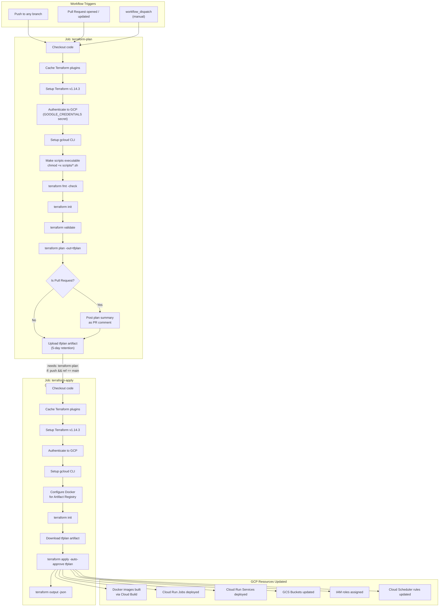

# CI/CD Pipeline

GitHub Actions workflow that automates Terraform infrastructure planning and deployment.

## Workflow Diagram



## Environment Variables & Secrets

| Name | Source | Used In |
|------|--------|---------|
| `GOOGLE_CREDENTIALS` | GitHub Secret | GCP authentication |
| `HF_TOKEN` | GitHub Secret | Hugging Face model downloads |
| `GEMINI_API_KEY` | GitHub Secret | Gemini API (annotator, extractor) |
| `GITHUB_TOKEN` | Built-in | Posting PR comments |
| `TF_VAR_github_sha` | `github.sha` | Content hash for image tagging |
| `TF_VAR_github_username` | `github.actor` | Deployment context labelling |

## Concurrency

The workflow uses a concurrency group keyed on the branch name, cancelling any in-progress run for the same branch when a new commit is pushed:

```
group: ${{ github.workflow }}-${{ github.head_ref || github.ref_name }}
cancel-in-progress: true
```

## Content-Hash Deployment Strategy

Terraform uses a content hash of each job's source directory to decide whether to rebuild and redeploy the Docker image:

- **Local builds**: hash computed from file contents using `scripts/compute_content_hash.sh`
- **GitHub Actions builds**: hash derived from `GITHUB-{first 7 chars of commit SHA}`

This ensures that only changed jobs trigger a new Cloud Build + Cloud Run deployment, minimising build time and cost.
