# Data Pipeline

End-to-end flow of data from the DVB Burmese news website through scraping, cleaning, crisis classification, human review, annotation, and structured extraction.

## Pipeline Flow Diagram

```mermaid
flowchart TD
    DVB["DVB Burmese News<br>dvb.no/category/8/news"]

    subgraph CrawlJob["Cloud Run Job - dvb-crawler-job"]
        C1["Fetch yesterday's articles<br>Axios + Cheerio"]
        C2["Unicode NFC normalisation<br>Remove zero-width chars"]
        C3["Write JSON metadata<br>+ article text files"]
    end

    subgraph CrawlerBucket["GCS - crawler-data"]
        RAW["raw_articles/<br>YYYY-MM-DD/*.json<br>*.txt"]
    end

    subgraph CleanJob["Cloud Run Job - dvb-text-cleaner-job"]
        CL1["Read raw articles"]
        CL2["Remove DVB author names<br>and source citations"]
        CL3["Validate min-length<br>and Burmese character ratio"]
        CL4["Write cleaned articles"]
    end

    subgraph CleanedBucket["GCS - cleaned-crawler-data"]
        CLEAN["cleaned_articles/<br>YYYY-MM-DD/*.txt"]
    end

    subgraph ClassifyJob["Cloud Run Job - crisis-classifier-job"]
        CF1["Load Hugging Face model<br>sentence-transformers"]
        CF2["Classify each article<br>crisis vs. non-crisis"]
        CF3["Write crisis articles<br>to crisis bucket"]
    end

    subgraph CrisisBucket["GCS - crisis-crawler-data"]
        CR1["pending_articles/"]
        CR2["crisis_articles/<br>confirmed"]
        CR3["annotated_articles/"]
    end

    subgraph AdminService["Cloud Run Service - crisis-admin"]
        ADM["Admin reviews article<br>Approve to move to crisis_articles/"]
    end

    subgraph AnnotatorService["Cloud Run Service - dvb-annotator<br>Admin-triggered after crisis-admin move"]
        AN1["Invoked by admin job run<br>gcloud run jobs execute dvb-annotator-job"]
        AN2["Call Gemini API<br>Add structured annotations"]
        AN3["Write annotated JSON<br>to annotated_articles/"]
    end

    subgraph ExtractorService["Cloud Run Service - dvb-extractor<br>Admin-triggered after annotation"]
        EX1["Invoked by admin job run<br>gcloud run jobs execute dvb-extractor-job"]
        EX2["Call Gemini API<br>Extract crisis events"]
        EX3["Write structured<br>extraction JSON"]
    end

    subgraph ExtractionBucket["GCS - llm-extraction"]
        EXT["extracted_events/<br>YYYY-MM-DD/*.json"]
    end

    subgraph MLflowService["Cloud Run Service - mlflow"]
        ML["Track model experiments<br>Store artifacts<br>Model registry"]
    end

    subgraph MLBucket["GCS - mlflow-artifacts"]
        MLA["experiments/<br>models/"]
    end

    DVB -->|"HTTP scrape daily midnight"| C1
    C1 --> C2 --> C3
    C3 --> RAW

    RAW --> CL1
    CL1 --> CL2 --> CL3 --> CL4
    CL4 --> CLEAN

    CLEAN --> CF1
    CF1 --> CF2 --> CF3
    CF3 --> CR1

    CR1 --> ADM
    ADM -->|Approve| CR2

    CR2 -->|"Admin: run dvb-annotator-job"| AN1
    AN1 --> AN2 --> AN3
    AN3 --> CR3

    CR3 -->|"Admin: run dvb-extractor-job"| EX1
    EX1 --> EX2 --> EX3
    EX3 --> EXT

    CF2 -.->|log metrics| ML
    ML --> MLA
```

## Storage Bucket Summary

| Bucket | Contents | Retention |
|--------|----------|-----------|
| `{project}-crawler-data` | Raw scraped articles (JSON + TXT) | 90 days |
| `{project}-cleaned-crawler-data` | Cleaned and validated articles | 90 days |
| `{project}-crisis-crawler-data` | Pending, confirmed, and annotated crisis articles | 180 days |
| `{project}-llm-extraction` | Gemini-extracted structured crisis events | Long-term |
| `{project}-mlflow-artifacts` | MLflow experiment artifacts and model registry | 90 days |

## Trigger Summary

| Job / Service | Trigger | Schedule / Event |
|---------------|---------|-----------------|
| `dvb-crawler-job` | Manual / workflow | Ad-hoc |
| `dvb-text-cleaner-job` | Manual / workflow | Ad-hoc |
| `crisis-classifier-job` | Manual / workflow | Ad-hoc |
| `daily-data-processor` | Cloud Scheduler | `0 * * * *` (every hour) |
| `dvb-annotator` | Admin-triggered job | Run `dvb-annotator-job` after `crisis_articles/` move |
| `dvb-extractor` | Admin-triggered job | Run `dvb-extractor-job` after `annotated_articles/` produced |
