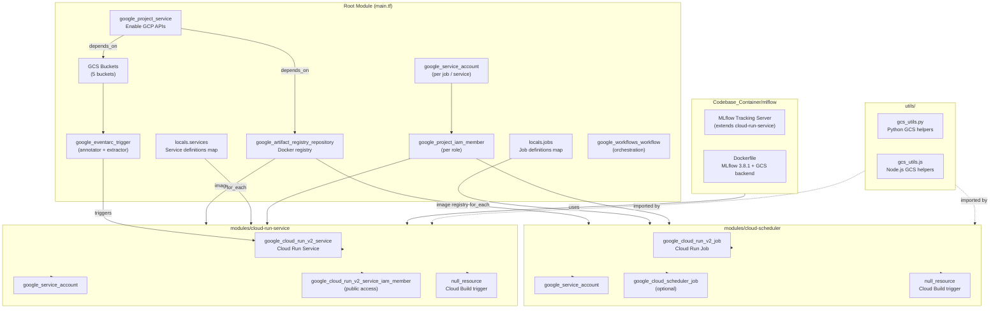

# Infrastructure Modules

Terraform module structure and the relationship between root-level resources and reusable modules.

## Module Dependency Diagram



## Module Input/Output Summary

### `modules/cloud-scheduler`

Provisions a **Cloud Run Job** with an optional **Cloud Scheduler** trigger and a **Cloud Build** step to build and push the Docker image.

| Input Variable | Description |
|----------------|-------------|
| `codebase_path` | Path to the job's source directory (for Docker build) |
| `container_image` | Full Artifact Registry image URI |
| `enable_scheduler` | Whether to create a Cloud Scheduler rule |
| `schedule` | Cron expression (e.g. `0 * * * *`) |
| `enable_gpu` | Attach NVIDIA L4 GPU accelerator |
| `cpu_limit` | vCPU limit |
| `memory_limit` | Memory limit (e.g. `512Mi`, `16Gi`) |
| `timeout` | Job execution timeout |
| `environment_variables` | Map of env vars injected into the container |
| `service_account_roles` | IAM roles granted to the job's service account |

### `modules/cloud-run-service`

Provisions a **Cloud Run Service** (always-on HTTP) with optional public access and a **Cloud Build** step.

| Input Variable | Description |
|----------------|-------------|
| `codebase_path` | Path to the service's source directory |
| `container_image` | Full Artifact Registry image URI |
| `cpu_limit` | vCPU limit |
| `memory_limit` | Memory limit |
| `min_instances` | Minimum number of running instances |
| `max_instances` | Maximum number of running instances |
| `port` | HTTP port the container listens on |
| `allow_public` | Whether to grant unauthenticated access |
| `environment_variables` | Map of env vars injected into the container |
| `service_account_roles` | IAM roles granted to the service's service account |
| `cloud_sql_instances` | List of Cloud SQL connection strings (optional) |

### `Codebase_Container/mlflow`

Contains the MLflow Cloud Run container assets used by the root module's `mlflow` service entry.

## Directory Structure

```
CPE_Final_Project/
├── main.tf                    # Root module — orchestrates all resources
├── variables.tf               # Input variables with defaults
├── outputs.tf                 # Exported values (URLs, bucket names, etc.)
├── provider.tf                # GCP provider + GCS backend for Terraform state
├── modules/
│   ├── cloud-scheduler/       # Reusable Cloud Run Job + Scheduler module
│   └── cloud-run-service/     # Reusable Cloud Run Service module
├── Codebase_Container/
│   ├── mlflow/               # MLflow server container assets
│   ├── crawler_job/           # dvb-crawler-job source (Node.js)
│   ├── gpu_batch_job/         # gpu-batch-job source (Python + PyTorch)
│   ├── cloud_scheduler_function/ # daily-data-processor source (Python)
│   ├── text_clean_codebase/   # dvb-text-cleaner-job source (Python)
│   ├── crisis_classifier_job/ # crisis-classifier-job source (Python + HF)
│   ├── extractor_job/         # dvb-extractor source (Python + Gemini)
│   ├── annotator_job/         # dvb-annotator source (Python + Gemini)
│   └── crisis_admin/          # crisis-admin source (Python)
├── utils/
│   ├── gcs_utils.py           # Shared Python GCS helpers
│   └── gcs_utils.js           # Shared Node.js GCS helpers
└── scripts/
    ├── terraform_compute_hash.sh     # Unix Terraform hash adapter
    ├── terraform_compute_hash.ps1    # Windows Terraform hash adapter
    ├── get_deployed_content_hash.sh  # Unix deployed hash lookup
    ├── get_deployed_content_hash.ps1 # Windows deployed hash lookup
    ├── get_username.sh               # Unix username lookup
    ├── get_username.ps1              # Windows username lookup
    ├── hash_module.sh                # Shared Unix hash helpers
    └── Hash-Module.psm1              # Shared PowerShell hash helpers
```
